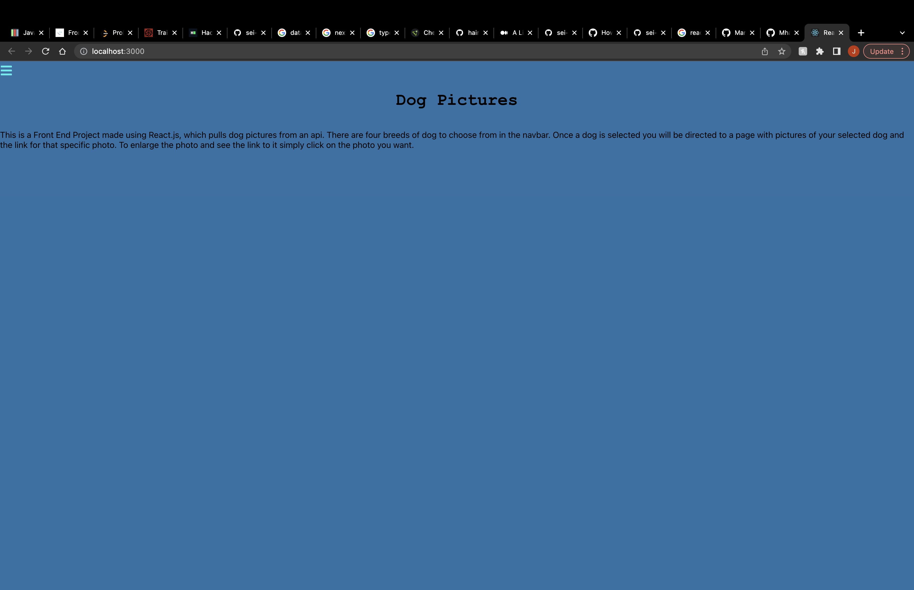

# Dog Picture API

---

### Description

---

This is a front-end designed for a application programing interface that was made by my fellow classmate Bryant at General Assembly. This is his original link for the API https://github.com/bryxnt1/api-project. The API stores pictures of dogs categorized by breed, so my main goal was to create a front-end that did a good job of showcasing all the different pictures.

When you first arrive to the site the home page describes exactly what it is and how to use it.

Here we can see the sliding hamburger menu that is used to navigate through the different pages

This is showing the individual dog page and how the pictures are displayed. Under the rows of dog pictures there are two arrow buttons that cycle through the list of pictures.

Finally we can see the modal that pops up of a picture thats clicked and underneath the enlarged picture is the image address.

### Technologies Used

---

- Javascript
- React.js

### Future Features

---

- Give it a responsive design
- Full CRUD functionality
- Better Styling
- In-depth Documentation
